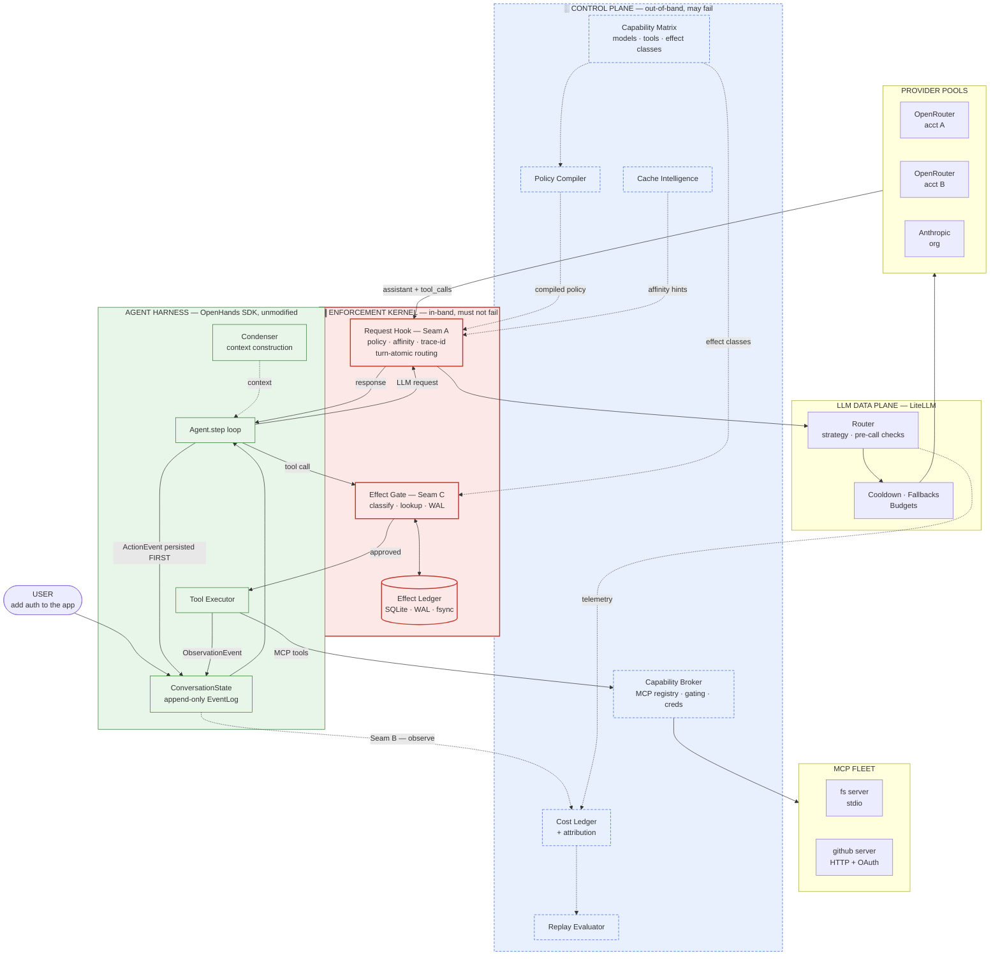
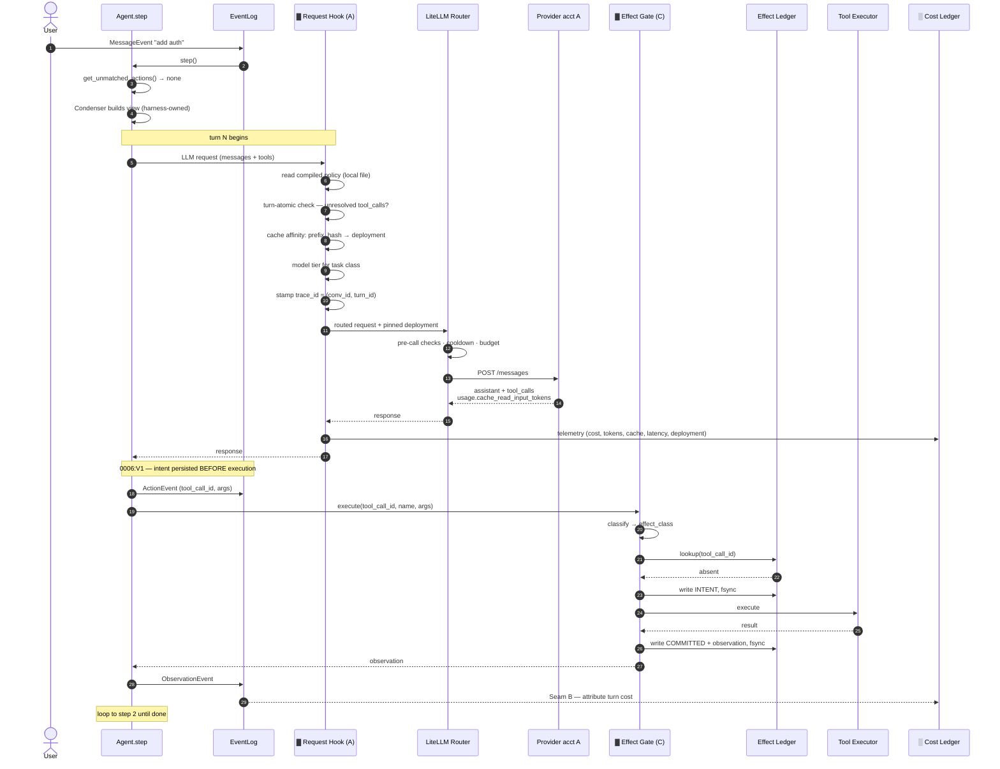
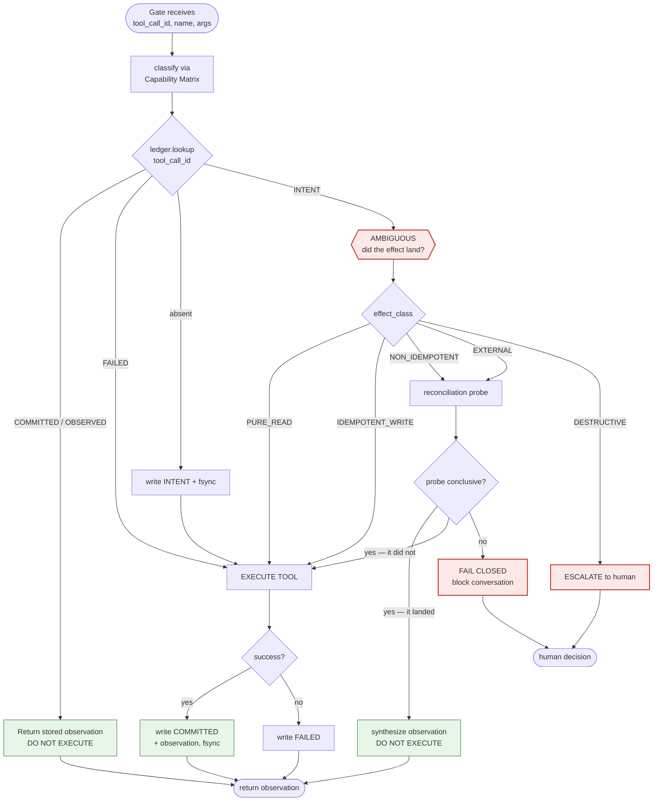
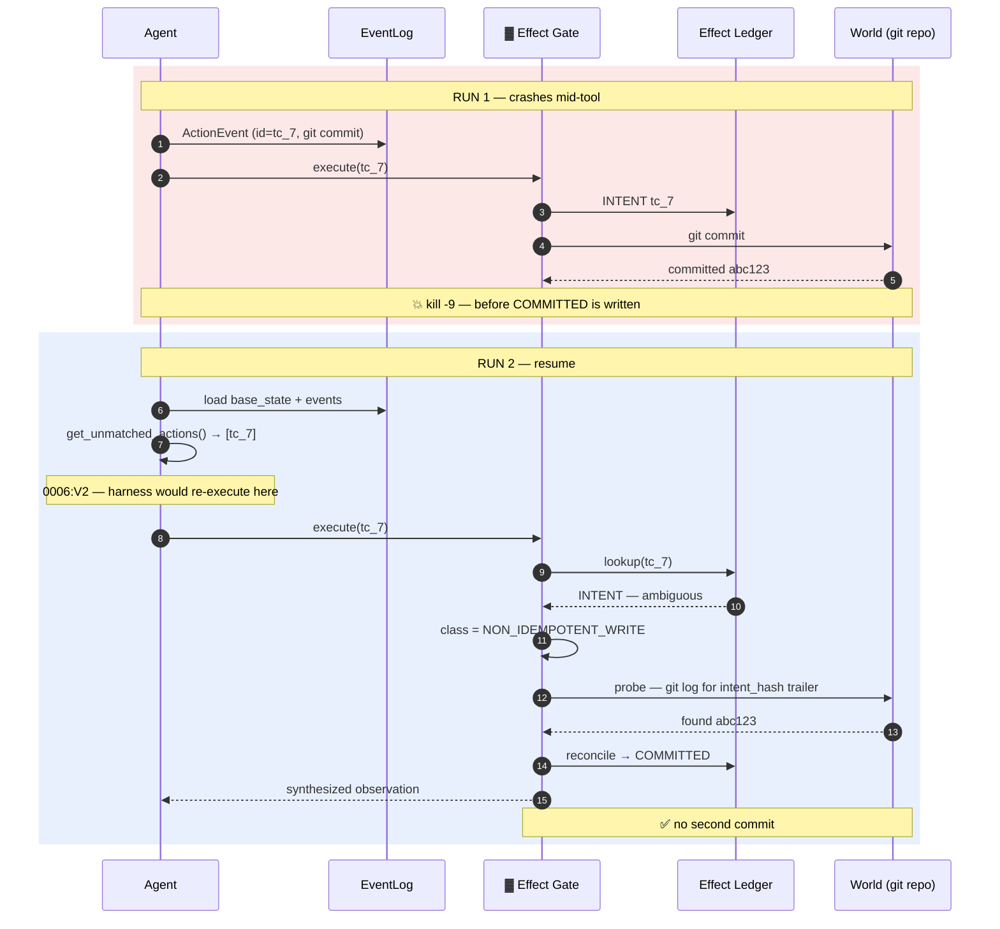
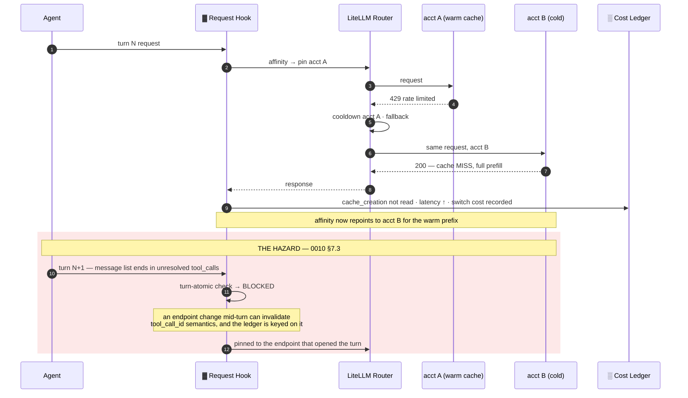
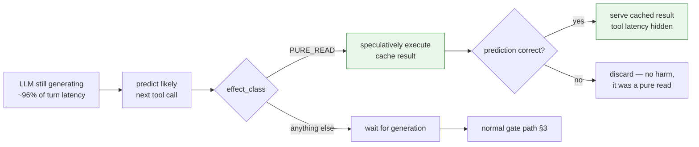

# 0011 — Request Flow

One user request, traced through every concept in the architecture. Companion
to `0008` (which argues *why*) and `0010` (which adds latency, switching, and
MCP). This document shows *what actually happens*.

Diagrams are Mermaid so they render on GitHub and stay diffable.

**Legend used throughout**

| Marker | Meaning |
|---|---|
| **A** | Seam A — LiteLLM `CustomLogger` hook |
| **B** | Seam B — harness event callback (observe only) |
| **C** | Seam C — tool executor wrapper (the only enforcement point) |
| ▓ | In-band. Must not fail. |
| ░ | Out-of-band. May fail. |

---

## 1. The static picture — who owns what

**The three things to read off this picture:**

1. The control plane touches nothing on the request path. It publishes
   artifacts (compiled policy, affinity hints, effect classes) and consumes
   telemetry. Cut every dashed line and work continues on the last artifacts.
2. The kernel is two small boxes plus a local database. Everything clever
   happens out-of-band.
3. Seam C sits between `Agent` and `Tool Executor` — the only point in the
   whole system where an effect can be stopped before it lands.

---

## 2. The happy path — one full turn

**Steps 14–15 are the whole project.** Everything before them is existing
software; everything after is bookkeeping. The gap between "intent persisted"
and "effect recorded" is where double execution lives.

---

## 3. The Effect Gate decision — the correctness core

The `INTENT` branch is the irreducible ambiguity from `0008` §6.5. Note that
three of five classes escape it cheaply — which is why classification, not
cleverness, is what makes this tractable.

---

## 4. Crash and resume — where the ledger earns its existence

Without the ledger, run 2 produces a duplicate commit. That is the confirmed
behavior in `0006:V1`/`V2`, not a hypothetical.

---

## 5. Provider failover — and the rule that protects it

Failover between turns is cheap and already handled by the data plane. Failover
*within* a turn can defeat the effect ledger's primary key — hence the rule:
**the turn is the atomic unit of routing.**

---

## 6. Where each concept appears

| Concept | Diagram | Step / node |
|---|---|---|
| Session identity | §1 | `ConversationState` — harness-owned (`0007`) |
| Turn | §2 | steps 6–24, one `Agent.step` iteration |
| Journal | §1, §2 | `EventLog`, append-only (`0006:V3`) |
| Context vs memory | §1 | Condenser — SKIP verdict, harness-owned |
| Control / data plane split | §1 | dashed lines only, no hot-path edge |
| Seam A — Request Hook | §2 | steps 7–13 |
| Seam B — observe | §1, §2 | `EventLog` → Cost Ledger |
| Seam C — Effect Gate | §2, §3 | steps 15–21 |
| Write-ahead intent | §2, §3 | `write INTENT, fsync` |
| Effect classification | §3 | `classify` → 5 classes |
| Ambiguous state | §3, §4 | the `INTENT` branch |
| Reconciliation probe | §3, §4 | git log for intent hash |
| Fail closed | §3 | `BLOCK conversation` |
| Fail open | §1 | cut any dashed line — work continues |
| Cache affinity | §2, §5 | `prefix_hash → deployment` |
| Model tiering | §2 | `model tier for task class` |
| Cost attribution | §2 | `trace_id = (conv_id, turn_id)` |
| Policy compiler | §1 | compiled policy → Request Hook |
| Capability matrix | §1, §3 | feeds classifier and compiler |
| Provider pools / accounts | §1, §5 | acct A / acct B / org |
| Failover · cooldown | §5 | 429 → cooldown → acct B |
| Turn-atomic routing | §5 | the red block |
| MCP + Capability Broker | §1 | `Tool Executor` → Broker → MCP fleet |
| Replay evaluator | §1 | consumes Cost Ledger, off-path |
| Speculation (Layer 2) | §7 | below |

---

## 7. Layer 2 — speculative execution (not yet built)

The latency path from `0010` §6.4, shown for completeness. Gated on Q9.

Speculation is *strictly stricter* than replay safety: `IDEMPOTENT_WRITE` is
safe to repeat but not safe to speculate, because a discarded speculative write
has still mutated the world. Same classifier, higher threshold.

---

## 8. Status

DRAFT, inheriting every open question from `0009`. In particular:

- If **Q3** fails, Seam C does not exist and §2–§4 are unbuildable as drawn.
- If **Q2** fails, the ledger key in §3 is invalid.
- If **Q9** shows writes dominate, §7 is deleted.

These diagrams describe the intended design, not verified behavior.
